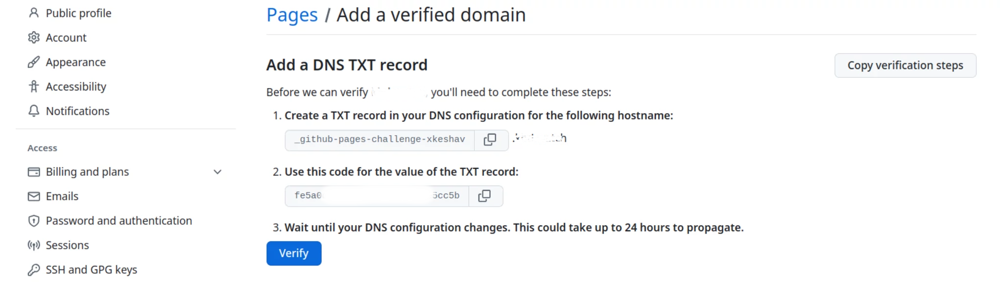
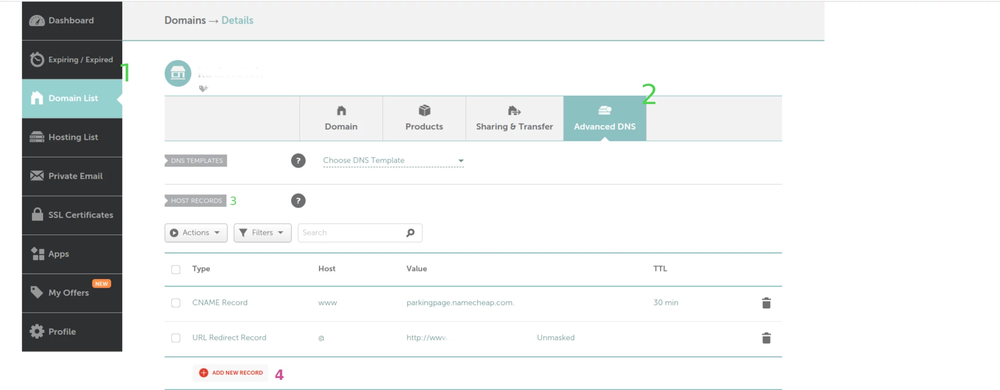
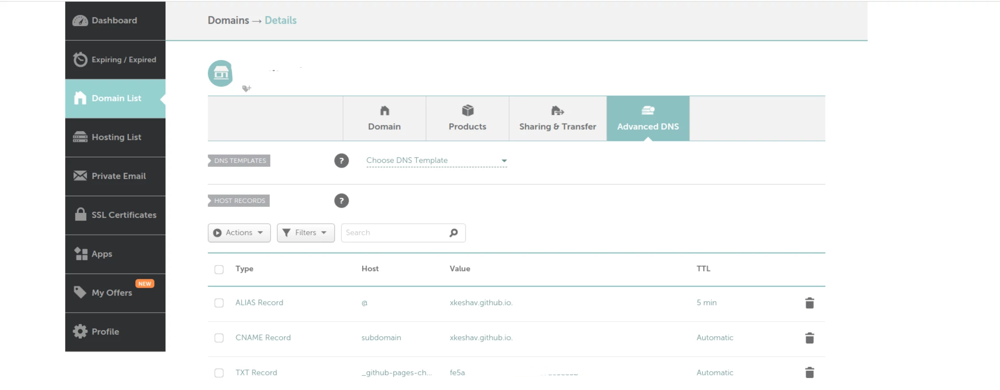
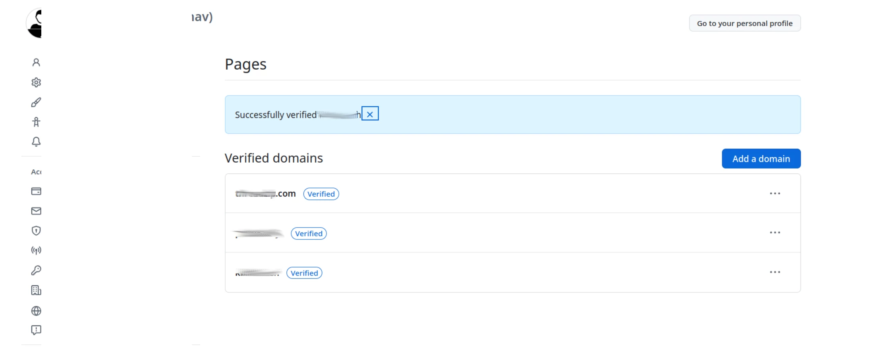

## Add Domain in GitHub

1. click on `Profile Icon > Settings > Page` ; it opens this link _github.com/settings/pages_

2. click `Add a domain` button , page link will be _github.com/settings/pages_verified_domains/new_

3. write domain name with without `www` ; click on _Add domain_ ; it will display to add DNS TXT record details
   

4. keep open this page; copy these record and go to your domain provider; in my case it is namecheap.com

## Add DNS record in domain provider

1. Login to namecheap.com
2. go to Domain List
3. click on _Manage_ button against your domain
4. Click on _Advanced DNS_ tab
5. Under HOST RECORDS panel click on ADD NEW RECORD plus icon 
6. Add TXT record
   A. Select Type `TXT Record`
   B. Host Name: Copy the first value shown on github ( do not add the domain name as prefix ; just the value copied )
   C. Value: Use the second code shown in github
   D. click on ✅ to save
7. Add CNAME
   A. Select Type `ALIAS Record`
   B. Host Name: add `@`
   C. Value: write `<github-user-name>.github.io`
   D. click on ✅ to save
8. Add CNAME
   A. Select Type `CNAME Record`
   B. Host Name: add `www`
   C. Value: write `<github-user-name>.github.io`
   D. click on ✅ to save

   Note: all old records ( the default one ) will be automatically removed.
   

9. Now go to github again and click on Verify button
10. it will be verified within 24 hours or immediately some time.
11. if it is fail to verify immediately; check after some hours and click on verify again option against your domain.
12. Finally it will look like this ; you can add multiple domain.



## Bonus tip

you can validate your domain using `dig` command ( need to install in system) and use it

```sh
> dig `domain name only` NS
> dig `domain name` +trace
```
