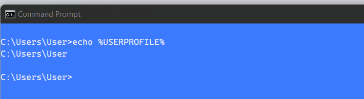

## How to set Aliases in Windows

alias are easy way to do long command short, in Unix there are .bashrc file where we can set alias but in Windows I did not find such thing straight forward, so here is the approach to do so.

## approach 1 (temporary)

usually we can open command prompt ( <code>win key + R</code> ) and type _cmd_ and set alias using `doskey`, for eg.

```sh
> doskey ll=dir
```

and now when run `ll` it will list all files of that folder.

which works good but problem in this approach is

1. we have to set every alias separately
2. these alias are temporary and only for the active session, as soon as we close the command prompt, alias are gone.

## approach 2 (permanent)

To overcome problem in approach 1, following are are steps to set permanent and multiple alias

1. first run below command in your command prompt `echo %USERPROFILE%` , output of above is the base path , in my case it is **C:/Users/User**



2. now create a new file name _alias_ on above location, you can name it anything, even with .txt extension also

3. now open this file in notepad or editor and add your daily use alias in it and save the file, mine are as below

```sh
   cat=type $*
   ..=cd..
   ls=dir $*
   gs=git status
   gp=git push
   gb=git branch
   nrs=npm run start
   dev=cd /d D:\Developer
```

Note:

- you need to add _/d_ if you create an alias to navigate to any directory
- path separator is forward slash `\`
- there is no space around _=_ while creating alias

now next part is to how to make it permanent so that it is available whenever you open the command prompt.

4. now open run command using <kbd>Win key + R</kbd> and type `regedit` it will open a new dialog window which is registry editor.

5. navigate to **Computer\HKEY_LOCAL_MACHINE\SOFTWARE\Microsoft\Command Processor** File, see attached screenshot.


6. right click to this file and select _New >> String Value_ and rename it to _Autorun_ and save it.

7. now double click on this newly created _Autorun_ key, a window open where you have to put below value in value data field (the address will be full path of your alias file) . see attached screenshot

```txt
   DOSKEY /MACROFILE="C:\Users\User\alias"
```


8. close the regedit and command prompt for once.

Now try your alias and thank me later. :)

let me know if it was helpful or something incorrect while you try, I would be happy to help

Cheers.
