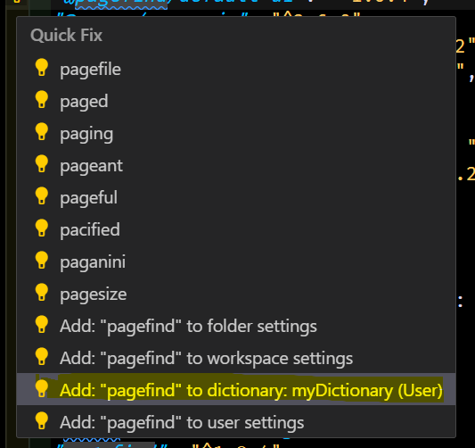
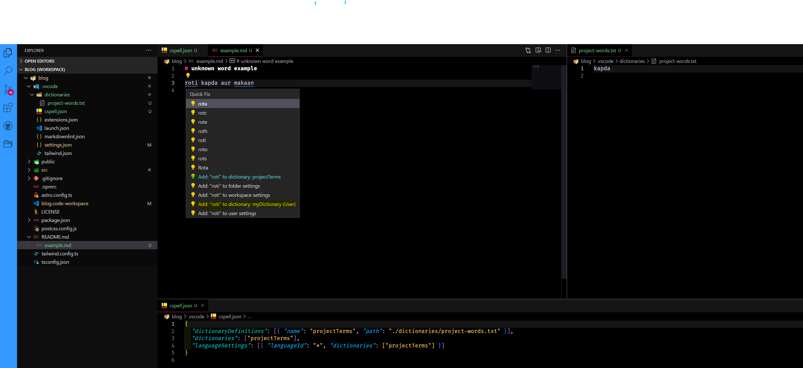

## Install Code Spell Checker extension

- install [Code Spell checker extension](https://marketplace.visualstudio.com/items?itemName=streetsidesoftware.code-spell-checker)

## Add Custom dictionary folder

- create a file on your system; name it anything; I set it as _myDictionary.txt_ ; you can add your words in a new line ( one word each line)

## Add settings in vs code settings

open vs code settings and edit the settings.json file

```json
 "cSpell.customDictionaries": {
    "myDictionary": {
      "name": "myDictionary",
      "path": "~/myDictionary.txt",
      "scope": "user",
      "addWords": true
    }
  }
```

## How it Workspace

when you see error hint on a word, right click on it and you will see the option

select Add Word in dictionary ( your dictionary name )



## Workspace specific dictionary

To add a dictionary at the project level should be defined in a _cspell.json_ file so it can be used with the cspell command line tool. This file can be either at the project root or in the .vscode directory.

you can add _.vscode/cSpell.json_ file

```json
{
  "dictionaryDefinitions": [{ "name": "projectTerms", "path": "./dictionaries/project-words.txt" }],
  "dictionaries": ["projectTerms"],
  "languageSettings": [{ "languageId": "*", "dictionaries": ["projectTerms"] }]
}
```

I have added one word 'kapda' there in project-words.txt and save it

now when we write a word which is not added in dictionary and specific for our project then it suggest word to add in your custom dictionary of workspace dictionary;

see the attaches screenshot to see the file placement and context menu suggestion



## extra tips

if you want to remove a full line under a unknown word and want to just a hint then update below settings

```json
"cSpell.diagnosticLevel": "Hint"
```

## References

- [extension official documents](https://github.com/streetsidesoftware/vscode-spell-checker)
