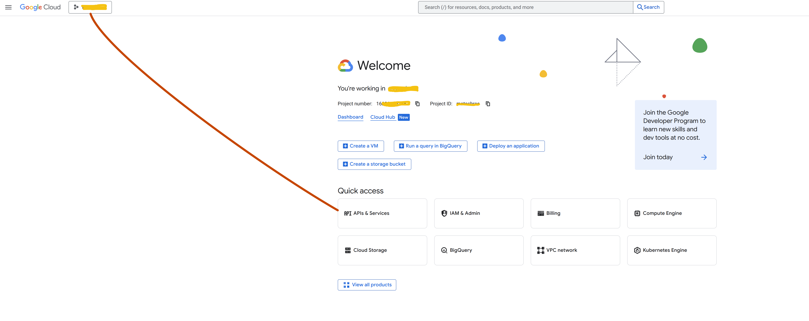

Google Console

1. go to landing page <https://console.cloud.google.com>  
2. or you can direct type the URL in address bar
3. the dashboard URL will be `https://console.cloud.google.com/home/dashboard?project=<projecy-name>`
4. Click on Project Picker on top right side and choose a project; if no project then create one
5. Click on dashboard / dashboard
6. click on hamburger menu

7. Click on **API** and **Service  > Enabled API & Services**
8. sometime its available in Quick Access Menu on the welcome page
9. Click on **Credentials** from left Panel

There you see **OAuth Client ID** and your API Keys

see 
