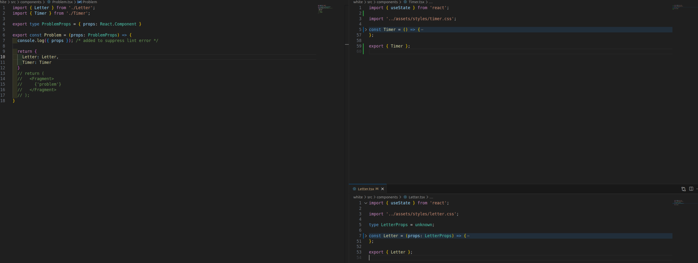
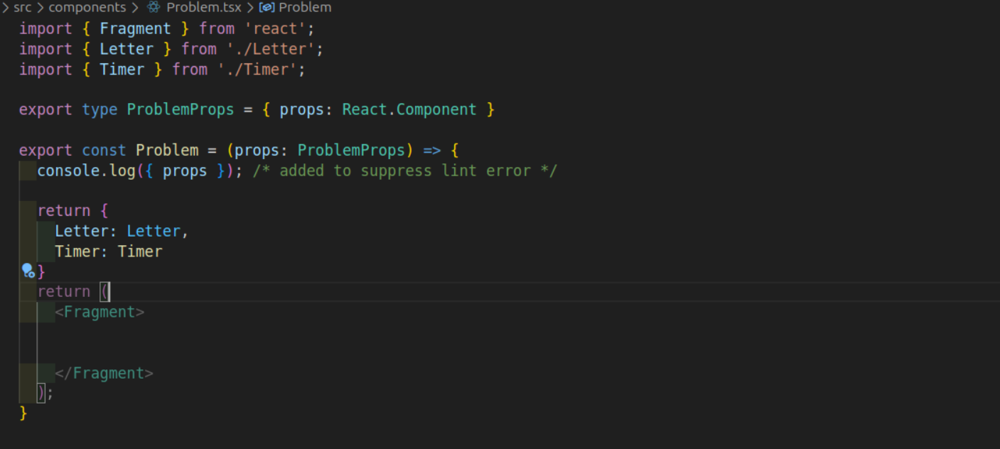

## Color change of 2 React Component in vs code

while writing imported component name in a page, it show 2 different colors for the 2 components, first I thought it might be due to theme but then try to find it why these 2 simple component are displaying separate color?

Here is the screenshot how it was looking



### pre-cap

Built 2 simple React component `Letter` and `Timer` in 2 files named export from the file and using in `Problem` component.

## Reason finding

when I check the components code, first I see there are 2 way of export syntax used; that coule be the reason

in *Timer* Page; user export inline

```ts  title='Timer.tsx'
export const Timer = () => {
// implementation
};

```

while in *Letter* Page; adding export on the end of page

```ts title='Letter.tsx'

const Letter: React.FC<LetterProps> = () => {
// implementation
}

export { Letter };
```

so change and make it similar fashion

but

still showing component name in different color, try `F1 >Reload Windows` in vscode to refresh and check but its still there.

again one of component have props while other do not have; might be that is the indication by vs code that it require props; but in that case it should  warning/error in *Problem* page while writing it, as prettier is working.

now check again and see that

`const Letter: React.FC<LetterProps>` -- we have typing defined just after component name while *Timer* do not have any props then how do we sure that it could be the reason,

so one way is to add prop in Timer and check but wait

I changed the type declaration

before changing that,  in *Problem* file , hover above the component and see the typing  and found something interesting

`Letter: React.FC<unknown>` while `Timer: () => JSX.Element`

both have separate types which is obvious but didn't help much till now.

now move the typing in *Letter* as below fashion

```ts title='Letter.tsx'
const Letter = (props: LetterProps) = {}
```

side: typing defined the previous way is also causing other issues too; will discuss this some other day.

in vscode, do  *F1 > Reload Window* again and now both component are in same color.

and now both types are `JSX.Element`



## Bonus Tip

use Dot notation for Functional Component in simplest way is to write a object

```tsx title='Problem.tsx'
import { Letter } from './Letter';
import { Timer } from './Timer';

export const Problem = {
  Letter: Letter,
  Timer: Timer
}
```

and later use it as below

```tsx title='App.tsx'
import { Problem } from './components/Problem';

const App = () => (
  <main className='main'>
    <Problem.Timer />
    <Problem.Letter />
  </main>
);
```

and it works
