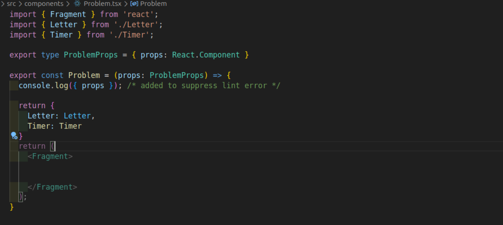
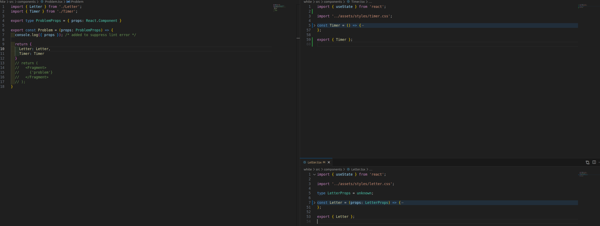

## Color Differences in React Components in VS Code

When you import component names in your React project, you might notice they appear in different colors. At first, you might think this is due to your theme settings. However, there’s a specific reason behind the color differences for these two components.

### What’s Happening?

In my project, I created two simple React components: `Letter` and `Timer`. They are exported from separate files and used in a main component called `Problem`. Here’s how they looked in the editor:



different-color

Notice the yellow and blue colors? Let's dive into why this happens.

### Investigating the Issue

Upon examining the code for both components, I discovered that they use different export syntaxes, which could explain the color difference.

In the **Timer** component file, the export is done inline:

```tsx title='Timer.tsx'
export const Timer = () => {
  // implementation
};
```

In contrast, the **Letter** component uses a different approach by exporting at the end of the file:

```tsx title='Letter.tsx'
const Letter: React.FC<LetterProps> = () => {
  // implementation
};

export { Letter };
```

I tried to modify both components to use the same export style, but the color difference persisted. I even refreshed VS Code with `F1 > Reload Window`, but that didn’t help either.

### Exploring Component Props

Another factor to consider is that one of the components has props defined while the other does not. This might indicate to VS Code that one component requires props. However, I expected to see a warning or error in the `Problem` component when using it since Prettier is active.

Looking more closely at the types:

- In `Letter.tsx`, we have `const Letter: React.FC<LetterProps>`, which defines typing right after the component name.
- The `Timer` component, on the other hand, does not have any props defined.

To investigate further, I hovered over each component in the `Problem` file and found something interesting:

- **Letter** is typed as `React.FC<unknown>`.
- **Timer** is typed as `() => JSX.Element`.

This indicates that they have separate types, but it still didn’t clarify why they were colored differently.

### Adjusting Type Definitions

To align their types, I modified the typing for `Letter` as follows:

```tsx title='Letter.tsx'
const Letter = (props: LetterProps) => {
  // implementation
};
```

**Note:** The previous typing method may cause other issues, which I will discuss another time.

After making this change, I refreshed VS Code again with `F1 > Reload Window`, and now both components displayed in the same color and were typed as `JSX.Element`.



same-color.

### Bonus tips

In TypeScript, when defining types for React components, the placement of the type annotations can indicate different meanings:

1. **Type Definition Ahead of the Component**: When you define the type directly ahead of the component declaration, like this:

   ```tsx
   const Letter: React.FC<LetterProps> = () => {
     // implementation
   };
   ```

   This is known as **Type Annotation** or **Type Declaration**. It specifies that `Letter` is a functional component that adheres to the `React.FC` (Function Component) type, which allows for props to be passed into it. The `LetterProps` indicates the shape of the props that the component expects.

2. **Type Definition Inside Props**: When you define the type within the props parameter, like this:

   ```tsx
   const Letter = (props: LetterProps) => {
     // implementation
   };
   ```

   This is referred to as **Inline Type Annotation**. Here, `LetterProps` defines the structure of the `props` object that is being passed to the component. This method can be useful for quickly defining types without explicitly stating that the component is a functional component.

### Summary

- **Type Declaration** (e.g., `const Letter: React.FC<LetterProps>`) indicates that you are declaring a functional component with specific prop types.
- **Inline Type Annotation** (e.g., `const Letter = (props: LetterProps)`) defines the type of props directly within the function parameters.

Both methods are valid and can be used based on your preference for clarity and style in your code.

By understanding these nuances regarding color differences and type definitions in VS Code, you can improve your React development experience!
