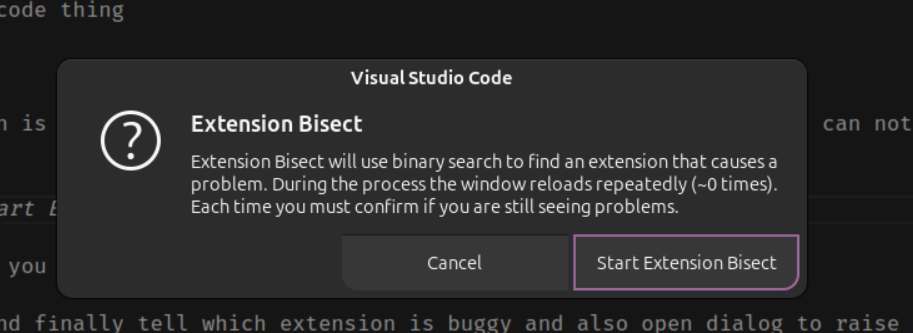
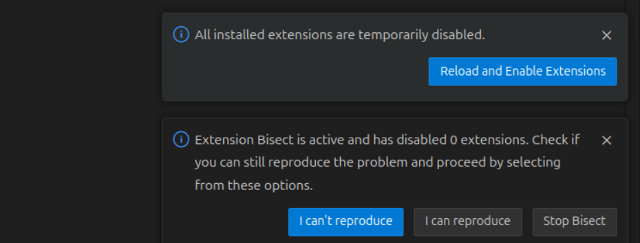
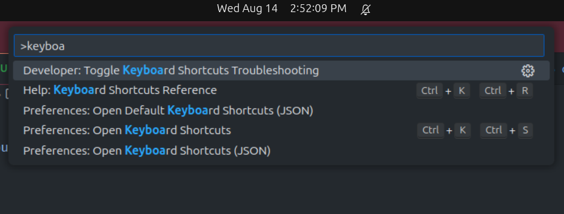
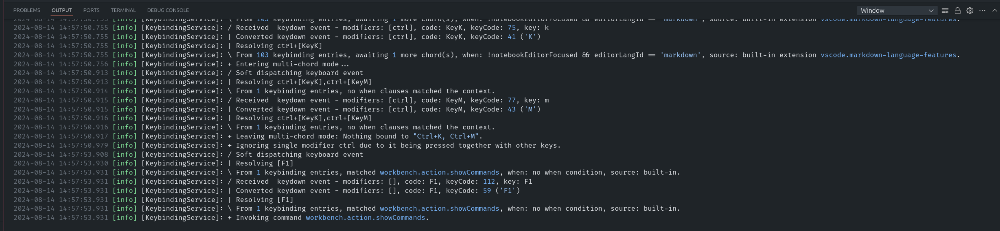

## VS Code inbuilt feature to detect issues

There are 2 important features which helps VS Code users

## Buggy Extension

Extension are great features but when we installed a lot of extension then sometimes it become lazy and sometimes stuck and notice that vs code behave weird?

- like cursor automatically jumping here and there
- when save file; formatting getting changed ( which is mainly lint and formatter config; which I cover some other day)
- on specific file types; things are not working as it should be

Below approach works through Command Panel

### Command Panel

- from version 1.80+ the Command Panel appears in top center where see the file title. there you type command using `>` prefix
  or
- Press F1 or `Ctrl + P` of `Cmd+P`

### Disable All Extensions

there is one way to disable all extension in vs code

- Open Command Panel
- type `Disable All Extensions` it will show a command with _Extensions:Disable All Extensions`_
- select and hit Enter

and check whether behavior is still there then it is your code thing

### Extension Bisect Command

and if it works then we have to find exactly which extension is buggy because few useful extension are needed during work; we can not take risk to disable all extension every time. so here is the way

- Command Panel using
- type `Extension Bisect`; it will show _Help: Start Extension Bisect_
- Select that and a popup appears to start it as below

- it will start to disable all extension and prompt whether are you able to reproduce the issue in bottom right side as below screenshot

you just try to reproduce the thing which causing the issue in your editor
select the option appropriately, it keep bisecting by disabling less n less extension on next iteration and finally tell which extension is buggy and also open dialog to raise issue (along with report)

most of times it worked for me as charm

## Keyboard Shortcut troubleshooting

Keyboard shortcuts are useful/ you can check all keyboard shortcut by pressing `Ctrl+K` `Ctrl+S` or on from bottom Left setting gear icon and choose Keyboard Shortcuts

in VS Code there are many command which can be used using command center and when we apply those there is also keyboard shortcut mentioned nearby to that command

for eg: F1 > Change Language Mode and you can see `Ctrl + K` `M` is mentioned on right side of command

and when you try the shortcut but if it is not working then how do you ensure ?

for eg. in Linux right and left Arrow keys are considered under NumPad but not the separate one

- Open Command Panel
- Type for `Keyboard` and option comes as `Developer: Toggle Keyboard Shortcut Troubleshooting`

An Output Panel will be opened automatically at bottom of the VS Code ( where terminal opens )

Fort eg.

I want to open Change language Mode which shows the keyboard shortcut

press the shortcut key combination ( which are not working as expected ) for the operation and it display the final key bindings

and in my case, when I check the log and found that I was typing `Ctrl + K` `Ctrl + M` while keyboard shortcut is `Ctrl + K` and `M` ( Press Ctrl + K Together and then leave `Ctrl` and just press `M` )

you can also notice the key, you are pressing, might be understood as different identifier by VS Code system ( vary from OS to OS)

Note: again click on the same option to close the troubleshoot guide.

Thanks.
